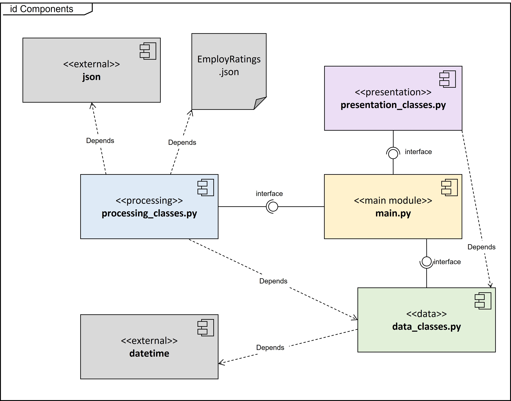
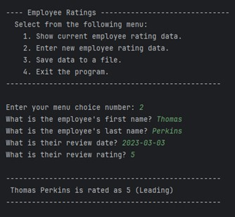

# Employee Evaluation Application
Developed by Thomas Perkins, 12/13/2023
For UW IT FDN 110, Foundations of Programming: Python

## Description
This application is a simple text-based program that allows entry, storage, and retrieval of employee performance information. It stores data using an external .json file located in the same directory as the files. The intended users of this application are managers and HR professionals in a fictitious office setting. 
The application and a version of this documentation in .md format can be found in the [GitHub Repository](https://github.com/UWtsperk/mod08)

## Use Cases and General Requirements
Please see UML Use Case diagram below:

These cases can also be summarized narratively:
1.	As a Manager, I need to record employee evaluation data so that I can have a record of year end evaluations.
2.	As a Manager, I need to collate and retrieve evaluation data so that I can prepare a year end team report.
3.	As an HR Specialist, I need to collate and retrieve evaluation data so that I can prepare a year end department report.
4.	As an HR Specialist, I need to analyze evaluation data so that I can track performance metrics for the department.
5.	As an IT Specialist, I need to retrieve and analyze team and department data for use analytics.
6.	As an IT Specialist, I need to reliably store and archive data in an easily accessible industry standard format.

The following Acceptance Criteria support these Use Cases and were supplied at the beginning of the application development project.

### Script Header: 
- The script headers are included in all files your name, the current date, and activity.
### Constants:
- FILE_NAME: str = "EmployeeRatings.json"
- MENU: str = [not shown]
### Variables:
- employees: list = []  # a table of employees data- menu_choice = ''
### Input / Output:
- On menu choice 1, the application prompts the user to enter the employee's first name and  last name, followed by the review date and rating.
- On menu choice 2, the presents the collected data.
- Data collected for menu choice 1 is added to a two-dimensional list table (list of Employee objects).
- All data in the list is displayed when menu choice 2 is used.
### Processing
- When the application starts, the contents of the "EmployeeRatings.json" are automatically read into a two-dimensional list table (a list of Employee object rows).
- On menu choice 3, the application saves it's data to the file named "EmployeeRatings.json".
- On menu choice 4, the application ends.

## Application Component Design
The application is organized into multiple modules, each one having a separate .py script file, that cover data, presentation, and processing layers. Please see the below UML Component Diagram for details.

The following Acceptance Criteria relevant to component design were given at the beginning of the development project:
### Files Named:
- There is a file is named data_classes.py
- There is a file is named processing_classes.py
- There is a file is named presentation_classes.py
- There is a file is named main.py
- There is a file is named test_data_classes.py
- There is a file is named test_processing_classes.py
- There is a file is named test_presentation_classes.py

## Application Class Design
The application defines classes in the component modules (except for main.py) as follows:
processing_classes.py:
1.	read_employee_data_from_file (staticmethod)
2.	write_employee_data_to_file (staticmethod)
presentation_classes.py:
1.	ouput_menu_choices (staticmethod)
2.	input_menu_choices (staticmethod)
3.	output_employee_data (staticmethod)
4.	input_employee_data (staticmethod)
data_classes.py:
1.	Person
2.	Employee (derived from Person)
These can be shown in the following UML Class Diagram:

The following Acceptance Criteria relevant to class design were given at the beginning of the development project:
### Classes:
- The application includes a class named FileProcessor.
- The application includes a class named IO.
- The application includes a class named Person.
- The application includes a class named Employee.
- All classes include descriptive document strings.
### Class Properties:
- The application includes properties for employee_first_name: str and defaults to an empty string.
- The application includes properties for employee_last_name: str and defaults to an empty string.
- The application includes properties for review_date: datetime.date and defaults to "1900-01-01".
- The application includes properties for review_rating: int and defaults to 3.
- The application's properties must include simple validation code.
### Class Methods:
- The application includes a method to extract comma separately data from each data class.
### Functions:
- All functions include descriptive document strings.
- All functions include except blocks that calls to the function handling error messages.
- All functions use the @staticmethod decorator.
- The application includes functions with the following names and parameters: 
    - output_error_messages(message: str, error: Exception = None
    - output_menu(menu: str)
    - input_menu_choice()
    - output_employee_data(employee_data: list)
    - input_employee_data(employee_data: list, employee_type: object)
- read_employee_data_from_file(file_name: str, employee_data: list, employee_type: object)
- write_employee_data_to_file(file_name: str, employee_data: list)

## Error Handling
The application captures and handles errors during data entry, processing, and presentation (input/output) operations. Handling is accomplished using standard Python try/except blocks and is present within both method and object classes, with console output via the output_error_messages static method function. 
The following Acceptance Criteria relevant to error handling were given at the beginning of the development project:
### Error Handling
- The application provides structured error handling when the file is read into the list of employee rows.
- The application provides structured error handling when the user enters a first name.
- The application provides structured error handling when the user enters a last name.
- The application provides structured error handling when the user enters a review date (YYYY-MM-DD).]
- The application provides structured error handling when the user enters a review rating (1,2,3,4, or 5).
- The application provides structured error handling when the data is written to the file.

## Testing
Unit tests scripts using Python’s unittest module are included for each of the application modules except for main.py. 
The following Acceptance Criteria for application testing were supplied at the beginning of the application development project.
### Test:  
- The application takes the user's input for an employee's first, last name, review date and rating.
- The application validates the user's input for an employee's first, last name, review date and rating.
- The application displays the user's input for employee's first, last name, review date and rating.
- The application saves the application's data into "EmployeeRatings.json" as valid Json syntax.
- The application allows users to enter multiple employee reviews.
- The application allows users to display multiple employee reviews.
- The application allows users to save multiple employee reviews to a file.
- The application runs correctly in both PyCharm and from the console or terminal. 
The following test results are shown:

*file end*

